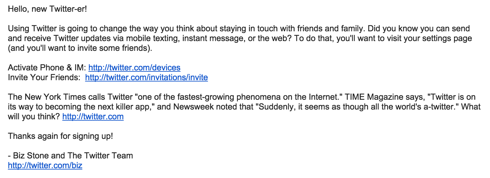

Screenshot:  
  

Email Type: Plain Text  
Site: http://twitter.com  
Date: 3 Jan 2009  
Subject: Welcoming you to Twitter!  

Source:  
```
Hello, new Twitter-er!

Using Twitter is going to change the way you think about staying in touch with friends and family. Did you know you can send and receive Twitter updates via mobile texting, instant message, or the web? To do that, you'll want to visit your settings page (and you'll want to invite some friends).

Activate Phone & IM: http://twitter.com/devices
Invite Your Friends:  http://twitter.com/invitations/invite

The New York Times calls Twitter "one of the fastest-growing phenomena on the Internet." TIME Magazine says, "Twitter is on its way to becoming the next killer app," and Newsweek noted that "Suddenly, it seems as though all the world's a-twitter." What will you think? http://twitter.com

Thanks again for signing up!

- Biz Stone and The Twitter Team
http://twitter.com/biz
```